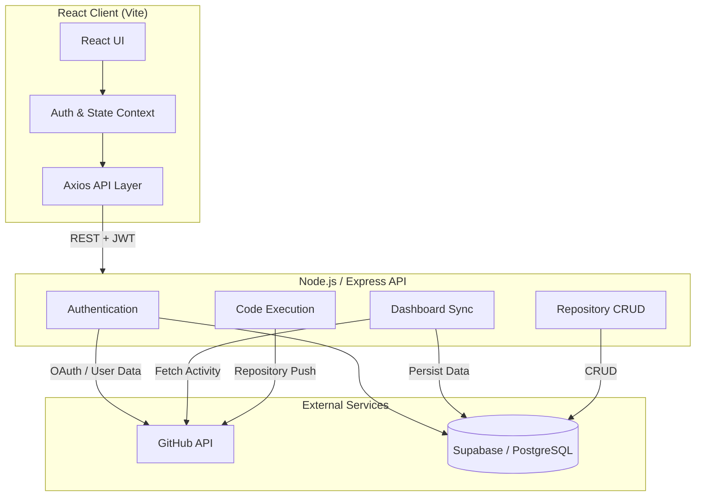

<div align="center">

# Open Source Contribution Tracker

### A full-stack developer workspace for GitHub activity, repository tracking, repository analysis, and code-to-repository workflows.

[Features](#-key-features) · [Architecture](#-architecture) · [Engineering Highlights](#-engineering-highlights) · [Getting Started](#-getting-started) · [Documentation](#-documentation)

</div>

---

## 📌 Problem

A developer's open-source work is distributed across commits, pull requests, issues, and multiple repositories. Reviewing that activity or managing tracked repositories often requires switching between different GitHub pages and workflows.

## 💡 Solution

**Open Source Contribution Tracker** brings these workflows into a single application.

The platform integrates with GitHub through OAuth, synchronizes contribution activity into a PostgreSQL database, and presents it through a centralized dashboard. Users can also manage tracked repositories, inspect public repository activity, and work with code snippets from the same application.

---

## ✨ Key Features

| Feature | Description |
|---|---|
| **GitHub Integration** | GitHub OAuth authentication with on-demand synchronization of commits, pull requests, and issues. |
| **Contribution Analytics** | Visual activity heatmap and contribution totals based on synchronized GitHub activity. |
| **Repository Workspace** | Track repositories with language, status, and personal notes through full CRUD operations. |
| **Repository Analysis** | Inspect public GitHub repositories using repository metadata and issue activity. |
| **Integrated Code Workflow** | Write and execute JavaScript or Python snippets and push code to tracked repositories. |
| **Responsive UI** | Responsive dark-mode-first interface built with React and Tailwind CSS. |

---

## 🏗️ Architecture

The application follows a **client-server architecture** in which the React frontend communicates with the Node.js/Express backend through a REST API.

The backend acts as the central integration layer between the client, GitHub, and PostgreSQL.



### Core API

The main backend workflows include:

```text
POST /dashboard/sync
GET  /dashboard
```

along with CRUD operations for tracked repositories.

For the detailed synchronization flow and system design, see:

**[Architecture Documentation](docs/architecture.md)**

---

## 🔄 Core Workflow

```text
GitHub OAuth
     ↓
User Authentication
     ↓
GitHub Activity Sync
     ↓
PostgreSQL Persistence
     ↓
Dashboard Analytics
     ↓
Repository Tracking
     ↓
Repository Analysis
     ↓
Code Execution / Repository Push
```

The application separates **data synchronization** from **dashboard reads**, allowing previously synchronized activity to be retrieved from the application's database.

---

## 🧠 Engineering Highlights

### Backend Boundary

All GitHub and database operations are handled by the Express backend instead of being accessed directly from the browser. This keeps server-side credentials and integration logic outside the client.

### Sync, Then Read

GitHub activity is fetched during an explicit synchronization operation and persisted in PostgreSQL. Dashboard requests can then read the stored data without repeatedly querying GitHub.

### Upsert-Based Synchronization

Activity records and statistics use upsert-based persistence so repeated synchronization can update existing data rather than continuously creating duplicate records.

### Stateless Authentication

After GitHub authentication, the backend issues a JWT. Protected API routes verify the token through authentication middleware before processing requests.

### Centralized API Layer

Axios interceptors provide a common place for attaching authentication information and handling authentication-related API errors instead of duplicating that logic across individual components.

---

## 🧰 Tech Stack

| Layer | Technology |
|---|---|
| **Frontend** | React, Vite, Tailwind CSS, Axios, React Context |
| **Backend** | Node.js, Express.js, JWT |
| **Database** | Supabase / PostgreSQL |
| **Integrations** | GitHub OAuth, GitHub REST API |

---

## 📂 Project Structure

```text
Open-Source-Tracker/
│
├── backend/              # Express API and server-side logic
│
├── frontend/             # React + Vite frontend
│
├── docs/
│   ├── architecture.md   # Detailed system architecture
│   └── database.md       # Database design and schema
│
├── .gitignore
├── netlify.toml
├── package.json
├── package-lock.json
└── README.md
```

---

## 🚀 Getting Started

### Prerequisites

- Node.js **18+**
- npm
- A **Supabase PostgreSQL** project
- A **GitHub OAuth App**

### 1. Clone the Repository

```bash
git clone https://github.com/sachinkumar-git/Open-Source-Tracker.git
cd Open-Source-Tracker
```

### 2. Configure the Database

Set up the required PostgreSQL tables using:

**[Database Documentation](docs/database.md)**

### 3. Configure Environment Variables

Create:

```text
backend/.env
```

```env
PORT=5000

JWT_SECRET=your_long_random_secret

SUPABASE_URL=https://your-project-ref.supabase.co
SUPABASE_SERVICE_ROLE_KEY=your-supabase-service-role-key

GITHUB_CLIENT_ID=your_github_oauth_client_id
GITHUB_CLIENT_SECRET=your_github_client_secret

FRONTEND_URL=http://localhost:5173
BACKEND_URL=http://localhost:5000
```

Create:

```text
frontend/.env
```

```env
VITE_API_URL=http://localhost:5000/api
```

> **Security:** Never commit `.env` files or secret credentials to the repository. The Supabase service-role key must remain server-side.

### 4. Run the Application

Start the backend:

```bash
cd backend
npm install
npm run dev
```

Start the frontend in another terminal:

```bash
cd frontend
npm install
npm run dev
```

Open:

```text
http://localhost:5173
```

and authenticate using GitHub.

---

## 🔒 Security

- **JWT-protected routes:** Private API endpoints require a valid JWT.
- **Server-side credentials:** GitHub OAuth credentials and the Supabase service-role key remain in backend environment variables.
- **Environment protection:** `.env` files are excluded from version control.
- **Code execution filtering:** Submitted code is checked for restricted imports such as `fs`, `child_process`, and `net`. This is an input-level guardrail and should not be considered full process isolation.

---

## 📚 Documentation

Detailed technical documentation is maintained separately so the README remains focused on the project and its architecture.

- **[Architecture](docs/architecture.md)** — system architecture and application data flow
- **[Database](docs/database.md)** — database structure and schema

---

## 👤 Author

**Sachin Kumar**  
B.Tech CSE (AI/ML)

[GitHub](https://github.com/sachinkumar-git) · [LinkedIn](https://www.linkedin.com/in/sachin-sde)
