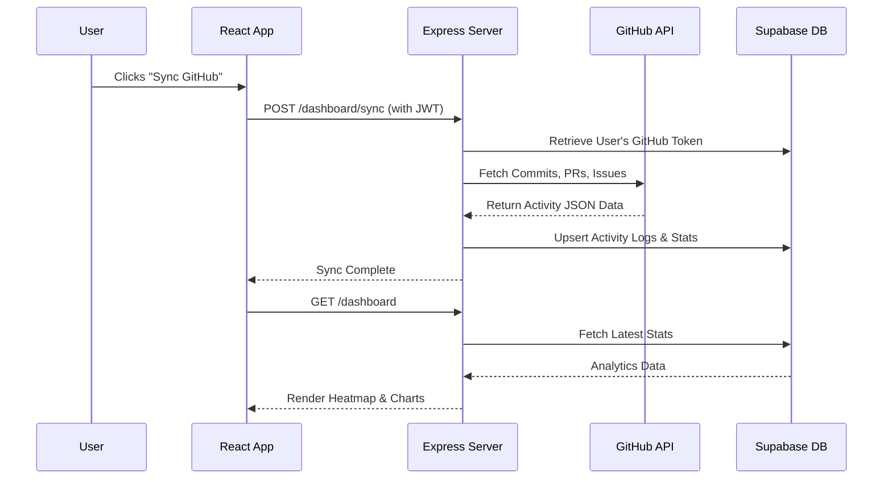

<div align="center">
  
  
  <br />
  <br />

  <p><strong>A professional tool for developers to track, analyze, and manage their open-source contributions.</strong></p>

  <p>
    <a href="#features"><strong>Explore Features</strong></a> ·
    <a href="#architecture"><strong>View Architecture</strong></a> ·
    <a href="#setup-guide"><strong>Setup Guide</strong></a>
  </p>

  <p>
    
    
    
    
    
  </p>
</div>

<hr />

## 🚀 Overview

The **Open Source Contribution Tracker** is a SaaS-level platform designed for developers who actively contribute to open-source projects. Track your commits, analyze your pull requests, monitor your issues, and push sandbox code seamlessly.

### ✨ Features
- **GitHub OAuth Integration:** Secure, seamless one-click authentication.
- **Activity Heatmaps:** Visualize your daily open-source contributions in a rich, interactive graph.
- **Repository Health Checking:** Analyze live GitHub repositories to check stars, forks, and issue health scores.
- **Integrated Code Sandbox:** Write, execute, and directly push JS/Python code snippets to your tracked GitHub repositories.
- **Dark-Mode First Design:** A beautiful, responsive interface built with TailwindCSS and custom CSS properties.

---

## 🏗️ Architecture

The platform uses a scalable architecture built on **Supabase** (PostgreSQL/Auth), **Express.js**, and **React**.

```mermaid
graph TD
    subgraph Frontend [React Client (Vite)]
        UI[React UI Components]
        Context[Auth & State Context]
        API_Layer[Axios Interceptors]
    end

    subgraph Backend [Node.js / Express API]
        AuthRoute[Auth Controllers]
        DashRoute[Dashboard Sync]
        RepoRoute[Repo CRUD]
        CompilerRoute[Sandboxed Exec]
    end

    subgraph External [Cloud Services]
        Supabase[(Supabase DB)]
        GitHub[GitHub API]
    end

    UI --> Context
    Context --> API_Layer
    API_Layer -- "REST API" --> Backend
    AuthRoute -- "OAuth/Token" --> Supabase
    RepoRoute -- "CRUD" --> Supabase
    DashRoute -- "Fetch Metrics" --> GitHub
    DashRoute -- "Store Stats" --> Supabase
    CompilerRoute -- "Push Code" --> GitHub
```

---

## 🔄 Data Flow: GitHub Sync

How your contributions are tracked and synchronized in real-time:



---

## 💻 Setup Guide

### Prerequisites
- Node.js (v18+)
- npm or yarn
- [Supabase](https://supabase.com) account & project
- [GitHub OAuth App](https://github.com/settings/applications/new)

### 1. Environment Variables Configuration

> **Security Note:** This repository uses a robust `.gitignore` file to ensure `.env` files are never exposed or pushed to GitHub. Your API keys are safe.

**Backend (`backend/.env`):**
```env
PORT=5000
JWT_SECRET=your_super_secret_jwt_key
SUPABASE_URL=https://your-project-ref.supabase.co
SUPABASE_SERVICE_ROLE_KEY=your-supabase-service-role-key
GITHUB_CLIENT_ID=your_github_oauth_client_id
GITHUB_CLIENT_SECRET=your_github_oauth_client_secret
FRONTEND_URL=http://localhost:5173
BACKEND_URL=http://localhost:5000
```

**Frontend (`frontend/.env`):**
```env
VITE_API_URL=http://localhost:5000/api
```

### 2. Database Schema (Supabase)
Execute the following in your Supabase SQL editor:
```sql
CREATE TABLE users (id uuid, github_id text, username text, email text, avatar_url text, github_access_token text);
CREATE TABLE repositories (id uuid, user_id uuid, repo_name text, repo_url text, language text, status text, notes text);
CREATE TABLE activity_logs (id uuid, user_id uuid, repo_name text, type text, date timestamp, message text, url text);
CREATE TABLE user_stats (id uuid, user_id uuid, commits int, pull_requests int, issues int, last_synced timestamp);
```

### 3. Installation & Running

```bash
# Clone the repository
git clone https://github.com/your-username/Open-Source-Tracker.git
cd Open-Source-Tracker

# Install and start backend
cd backend
npm install
npm run dev

# In a new terminal, install and start frontend
cd ../frontend
npm install
npm run dev
```

The application will be running at `http://localhost:5173`.

---

## 🔒 Security Features
- **Code Sandbox**: The online compiler explicitly sanitizes imports, preventing access to the `fs`, `child_process`, and `net` modules.
- **JWT Authentication**: All secure routes are protected by a middleware that verifies JWTs issued upon GitHub login.
- **Environment Isolation**: Sensitive credentials and API keys are stored in backend `.env` variables and are explicitly ignored in version control (`.gitignore`).

## 📄 License
Released under the [MIT License](LICENSE).
