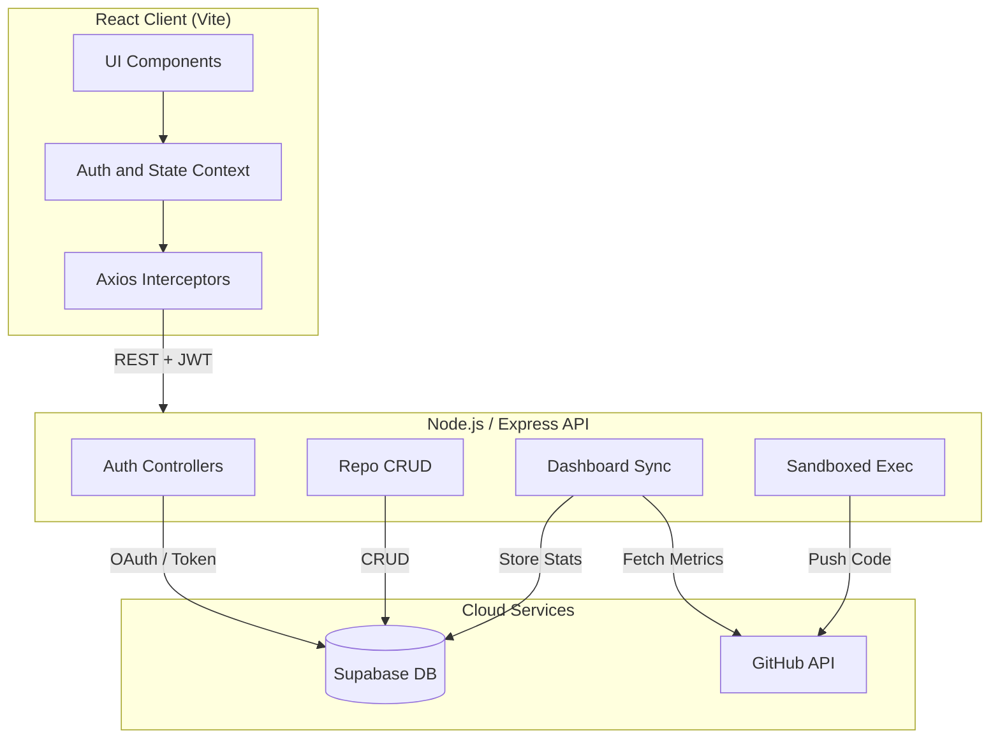

<div align="center">

# Open Source Contribution Tracker

**One dashboard for your GitHub activity, repository tracking, and code-to-repo workflow.**

[Features](#-key-features) · [Architecture](#-architecture) · [Engineering Highlights](#-engineering-highlights) · [Getting Started](#-getting-started) · [Docs](docs/)

<!--
ADD BEFORE PUBLISHING:
1. Live demo link on the line above, e.g. [Live Demo](https://your-app.vercel.app)
2. Hero screenshot or a 10-15 second GIF of the main workflow (login > sync > heatmap):

-->

</div>

---

## 📌 Problem

A developer's open-source work is spread across commits, pull requests, issues, and many repositories. There is no simple place to see that history over time, keep notes on the repos you follow, or try a small snippet and push it to one of them.

## 💡 Solution

Open Source Contribution Tracker signs you in with GitHub, syncs your activity into its own database, and shows it as a dashboard. From the same app you can track repositories, analyze any public repo, and push code snippets to your tracked repos.

## ✨ Key Features

- **GitHub integration:** one-click GitHub OAuth sign-in and on-demand sync of commits, pull requests, and issues.
- **Contribution analytics:** an activity heatmap and totals for commits, PRs, and issues.
- **Repository workspace:** track repos with language, status, and personal notes (full CRUD).
- **Repository analysis:** look up any public GitHub repo and see its stars, forks, and issue activity.
- **Integrated code workflow:** write JavaScript or Python, run it in the app, and push the snippet to a tracked repository.

The UI is responsive and dark-mode first, built with Tailwind CSS.

## 🏗️ Architecture

The React client talks only to the Express API. The API is the one place that holds secrets, calls GitHub, and writes to Supabase.



Key endpoints: `POST /dashboard/sync`, `GET /dashboard`, plus CRUD routes for repositories.
The step-by-step sync flow is in [`docs/architecture.md`](docs/architecture.md).

## 🧠 Engineering Highlights

- **Backend boundary.** All GitHub and database calls go through the Express API, so the GitHub client secret and the Supabase service-role key never reach the browser.
- **Sync, then read.** GitHub data is fetched during an explicit sync and stored in Postgres. Dashboard loads read from the database instead of calling GitHub every time, which keeps pages fast and avoids rate limits.
- **Upsert-based writes.** Activity logs and stats are upserted, so syncing again updates existing rows instead of adding duplicates.
- **Stateless auth.** After GitHub login the API issues a JWT, and a middleware verifies it on every private route.
- **Central request layer.** Axios interceptors attach the token and handle auth errors in one place.

## 🧰 Tech Stack

| Layer | Technology |
|---|---|
| Frontend | React (Vite), Tailwind CSS, Axios, React Context |
| Backend | Node.js, Express.js, JWT |
| Database | Supabase (PostgreSQL) |
| Integrations | GitHub OAuth, GitHub REST API |

## 🚀 Getting Started

**Prerequisites:** Node.js 18+, a [Supabase](https://supabase.com) project, and a [GitHub OAuth App](https://github.com/settings/applications/new).

```bash
git clone https://github.com/sachinkumar-git/Open-Source-Tracker.git
cd Open-Source-Tracker
```

**1. Create the database tables** using the SQL in [`docs/database.md`](docs/database.md).

**2. Add environment variables.**

`backend/.env`

```env
PORT=5000
JWT_SECRET=your_long_random_secret
SUPABASE_URL=https://your-project-ref.supabase.co
SUPABASE_SERVICE_ROLE_KEY=your-supabase-service-role-key
GITHUB_CLIENT_ID=your_github_oauth_client_id
GITHUB_CLIENT_SECRET=your_github_oauth_client_secret
FRONTEND_URL=http://localhost:5173
BACKEND_URL=http://localhost:5000
```

`frontend/.env`

```env
VITE_API_URL=http://localhost:5000/api
```

> The Supabase service-role key bypasses row-level security. Keep it in the backend only and never commit it.

**3. Run the app** in two terminals.

```bash
# backend
cd backend && npm install && npm run dev

# frontend
cd frontend && npm install && npm run dev
```

Open **http://localhost:5173** and sign in with GitHub.

## 🔒 Security

- **JWT-protected routes:** a middleware verifies the token on every private endpoint.
- **Secrets stay server-side:** OAuth credentials and the service-role key live only in backend environment variables, and `.env` files are git-ignored.
- **Sandbox input filtering:** submitted code is checked, and imports of `fs`, `child_process`, and `net` are blocked. This is a basic guardrail, not full isolation.

## 📄 License

Released under the [MIT License](LICENSE).

## 👤 Author

**Sachin Kumar**, B.Tech CSE (AI/ML)
[GitHub](https://github.com/sachinkumar-git) · [LinkedIn](https://www.linkedin.com/in/sachin-sde)