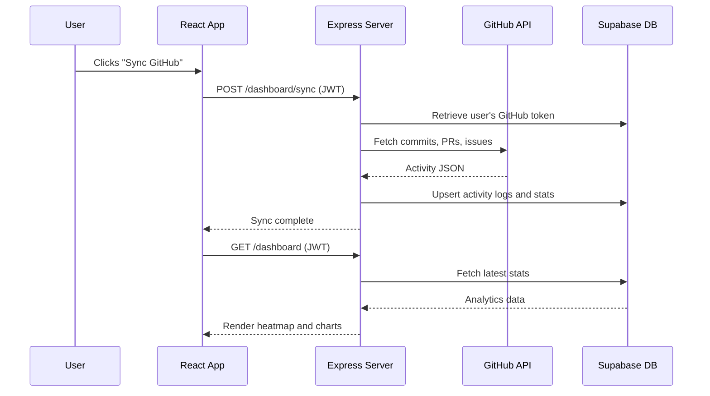

# Architecture

See the high-level diagram in the [README](../README.md#-architecture).

## GitHub sync flow

## Notes

- Sync is triggered by the user, not by a background job.
- The dashboard reads only from Supabase. GitHub is called during sync, repo analysis, and code push.
